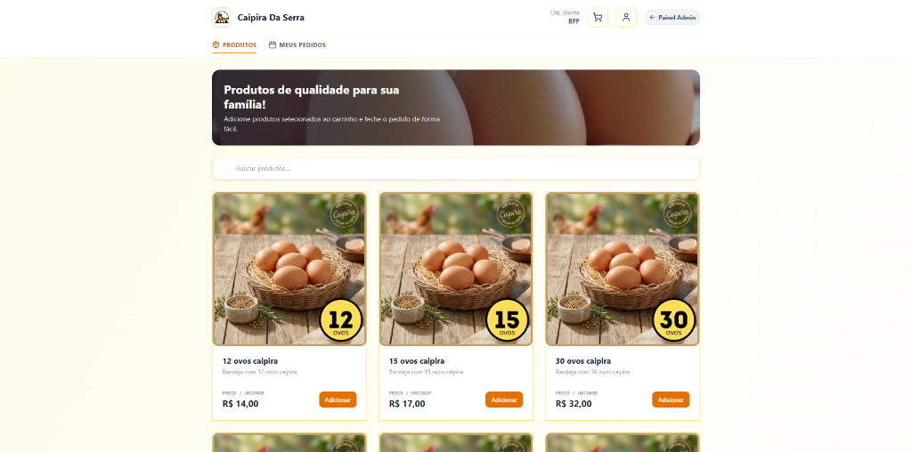
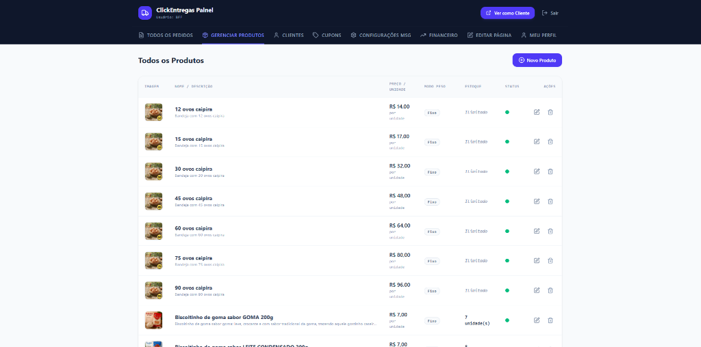

# ClickEntregas 🚚💨

O **ClickEntregas** é um sistema completo e otimizado para gestão de pedidos e entregas locais de mantimentos e fracionados. Ele resolve o problema de logística e controle operacional de pequenos comércios e delivery, fornecendo uma experiência rápida de compra e um gerenciador operacional integrado a partir de uma stack reativa em **React** e um backend serverless em **Supabase**.

---

## 🔗 Demonstração

O projeto pode ser acessado em produção através do link abaixo:
* **[Link para Demonstração Ativa (Deploy)](https://clickentregas.vercel.app)**

---

## ✨ Principais Funcionalidades

* **Catálogo de Produtos**: Exibição em tempo real com suporte a pesos decimais (Kg) e itens com peso aproximado.
* **Carrinho de Compras**: Gestão dinâmica de itens, quantidades e cálculos instantâneos de subtotais e frete.
* **Checkout Inteligente**: Preenchimento automatizado de CEP, taxas baseadas em bairros e geração de PIX Copy-Paste.
* **Gestão de Pedidos**: Acompanhamento e alteração de status dos pedidos em tempo real no painel administrativo.
* **Painel Administrativo**: Área administrativa protegida por senha criptografada para controle completo da loja.
* **Sistema de Cupons**: Criação e controle de cupons de descontos (fixo/porcentagem) com data limite e restrição de uso.
* **Integração ViaCEP**: Autocompletar dinâmico do endereço de entrega a partir do CEP informado pelo cliente.
* **Controle de Estoque**: Gerenciamento integrado e baixa automática de estoque de produtos ativos.

---

## 🛠️ Tecnologias Utilizadas

### Frontend
* **React 19** & **JavaScript (ES6+)** (SPA com JSX)
* **Vite 8** (Empacotador e servidor local)
* **Tailwind CSS 4** (Estilização responsiva e moderna)
* **Lucide React** (Pacote de ícones minimalistas)

### Backend / BaaS
* **Supabase** (Autenticação lógica, API REST exposta e infraestrutura serverless)

### Banco de Dados
* **PostgreSQL** (Armazenamento relacional e execução procedimental)

### Segurança
* **Web Crypto API** (Geração e validação de hashes SHA-256 no cliente)
* **Row Level Security (RLS)** (Segurança no nível de linhas do Postgres)

### Integrações
* **API ViaCEP** (Consulta de endereços por CEP)

---

## 📸 Screenshots

Aqui estão algumas capturas de tela da aplicação (Cliente & Admin):

#### Catálogo e Checkout (Cliente)


#### Painel de Pedidos e Configurações (Admin)


---

## ⚡ Destaques Técnicos

O projeto destaca-se pela aplicação prática de engenharia de software avançada na camada de persistência:
* **PostgreSQL Avançado**: Uso extensivo de joins estruturados, relacionamentos relacionais eficientes e views.
* **PL/pgSQL**: Linguagem procedural adotada para processamento lógico direto no servidor do banco.
* **Triggers**: Execução automática de regras em gatilhos para recalcular pedidos e atualizar informações críticas.
* **Row Level Security (RLS)**: Isolamento granular de leitura e escrita por usuário.
* **RPCs (Remote Procedure Calls)**: Funções de banco expostas de forma segura para consumo no frontend.
* **Arquitetura Serverless**: Toda a infraestrutura de backend é mantida no ecossistema do **Supabase**, reduzindo custos de hospedagem e complexidade de manutenção.

---

## 🛡️ Arquitetura e Segurança

Para proteger a integridade dos dados sem a necessidade de um backend dedicado, implementamos uma arquitetura de segurança blindada no banco de dados Supabase:

* **Row Level Security (RLS)**: Todas as tabelas têm segurança ativa. A API restringe consultas baseando-se em cabeçalhos HTTP customizados (`x-client-phone` para clientes e `x-admin-key` para o admin), isolando o histórico de pedidos e dados de clientes de forma inviolável.
* **Validação de Preços via Triggers**: Para impedir manipulações de valores no carrinho de compras via Javascript no navegador, a trigger `recalculate_order_total` recalcula no banco os totais de cada pedido com base nos preços e cupons oficiais cadastrados.
* **Controle de Acesso Administrativo**: A autenticação do admin é processada via hashes SHA-256 no cliente e validadas por meio de funções RPC seguras e unilaterais.
* **Isolamento de Funções Críticas**: A função de checagem da senha de admin e gatilhos de recálculos foram movidos para um esquema privado (`private.get_admin_password_hash`), ocultando-as completamente da API exposta publicamente pelo Supabase e evitando injeção de comandos.

---

## 🚀 Como Executar

### 1. Requisitos Prévios
* **Node.js** instalado na máquina.
* Uma conta no **Supabase** com um banco ativo.

### 2. Configurar o Ambiente Local
Clone o repositório, instale as dependências e configure o arquivo `.env` na raiz do projeto:

```bash
# Clone o repositório
git clone https://github.com/ArthurFurtado9/Clickentregas.git
cd Clickentregas

# Instale as dependências
npm install
```

Configure o arquivo `.env`:
```env
VITE_SUPABASE_URL=https://seu-projeto-supabase.co
VITE_SUPABASE_ANON_KEY=sua-chave-anonima-publica
VITE_ADMIN_PHONE=seu-telefone-de-admin
```

### 3. Executar o Projeto
```bash
# Rodar em desenvolvimento
npm run dev

# Gerar build de produção
npm run build
```

> [!TIP]
> O arquivo com a estrutura de tabelas, triggers e RLS do Supabase está disponível no arquivo [database.sql](./database.sql) na raiz deste repositório para facilitar a replicação do banco.

---

## ✍️ Autor

* **Arthur Furtado** - [Meu GitHub](https://github.com/ArthurFurtado9)
